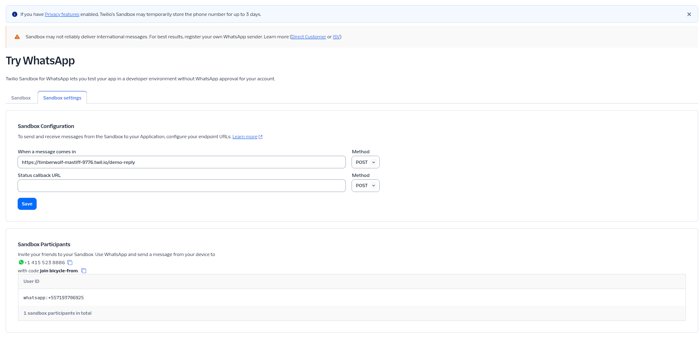
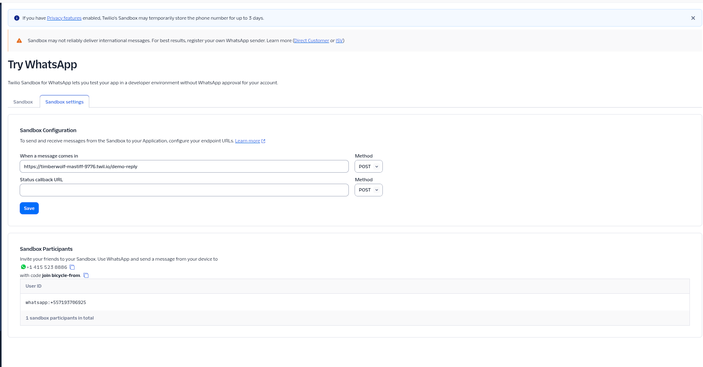
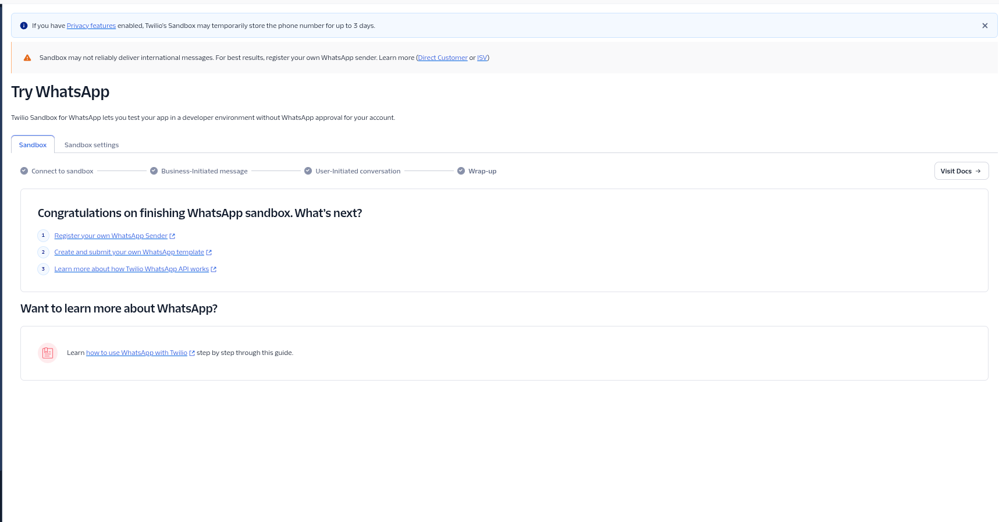

# Integração Twilio WhatsApp Business API

Canal de notificação via WhatsApp com botões interativos (quick-reply), usado para follow-up de agendamento e ofertas de vaga de fila de espera. Complementa o canal de e-mail (`EmailNotificationService`) com paridade de mensagens entre os dois canais.

## Visão Geral do Fluxo

1. `NotificationServiceImpl` dispara a notificação (follow-up ou oferta de fila de espera) para o paciente.
2. Se houver `waitlist-content-sid` configurado, a oferta de fila de espera é enviada via **Twilio Content API** (`WhatsAppNotificationService.sendQuickReply`), usando um **Content Template** pré-aprovado com variáveis e botões "Aceitar"/"Recusar".
3. O paciente responde clicando em um dos botões no WhatsApp.
4. O Twilio faz um `POST` para o webhook da aplicação (`WhatsAppWebhookController`) informando o número de origem (`From`) e o payload do botão clicado (`ButtonPayload`).
5. O controller identifica a oferta de fila de espera mais recente para aquele telefone (`WaitlistEntryRepository.findMostRecentOfferedByPatientPhone`), gera um action token interno (`AppointmentActionTokenService`) e reaproveita os mesmos use cases (`AcceptWaitlistOfferUseCase` / `DeclineWaitlistOfferUseCase`) usados pelos links públicos de e-mail — garantindo que a resposta por WhatsApp produza exatamente o mesmo efeito e a mesma mensagem de confirmação que o clique no link do e-mail.
6. A resposta ao Twilio é feita em **TwiML** (`<Response><Message>...</Message></Response>`), que o Twilio exibe como mensagem de volta ao paciente no WhatsApp.

## Variáveis de Ambiente

Configuradas em `.env`, mapeadas em `application.yaml` sob `app.notifications.twilio`:

| Variável | Uso |
|---|---|
| `TWILIO_ACCOUNT_SID` | Account SID da conta Twilio |
| `TWILIO_AUTH_TOKEN` | Auth Token — usado tanto para autenticar chamadas à API quanto para validar a assinatura do webhook recebido |
| `TWILIO_FROM_NUMBER` | Número WhatsApp-enabled do Twilio (remetente das mensagens) |
| `TWILIO_WAITLIST_CONTENT_SID` | SID do Content Template com os botões de aceitar/recusar oferta de vaga (default embutido no `application.yaml` caso não seja definido) |
| `TWILIO_WEBHOOK_BASE_URL` | URL pública base pela qual o Twilio alcança o webhook (ex: túnel Cloudflare em dev, domínio real em produção) — **crítico** para a validação de assinatura (ver seção abaixo) |
| `TWILIO_WEBHOOK_VALIDATE_SIGNATURE` | `true`/`false` — liga/desliga a validação de assinatura Twilio no webhook (default `true`; nunca desligar em produção) |

Nenhum desses valores deve ser hardcoded em código ou log em texto puro — apenas via variável de ambiente.

## Content Templates (Quick-Reply)

O envio de oferta de vaga usa `Message.creator(...).setContentSid(contentSid).setContentVariables(json)`, referenciando um **Content Template** cadastrado no Console Twilio com variáveis posicionais (`{{1}}`, `{{2}}`, ...) e botões de resposta rápida com payloads fixos `waitlist_accept` / `waitlist_decline` — esses payloads são o que o webhook usa para decidir qual ação executar.

Caso `TWILIO_WAITLIST_CONTENT_SID` não esteja configurado, o sistema cai para o envio de texto simples via `NotificationOrchestrator.notifyVia("WhatsAppNotificationService", ...)` (sem botões).

## Validação de Assinatura do Webhook

`WhatsAppWebhookController.isValidSignature()` usa `com.twilio.security.RequestValidator`, que recalcula um HMAC sobre a URL exata do webhook + parâmetros do POST e compara com o header `X-Twilio-Signature` enviado pelo Twilio. A URL usada no cálculo é `webhook-base-url + "/api/v1/notifications/whatsapp/webhook"`.

**Ponto crítico:** `webhook-base-url` precisa ser *exatamente* a URL pública que o Twilio realmente usou para chamar o webhook. Qualquer diferença (protocolo, domínio, barra final) faz a assinatura calculada localmente não bater com a enviada pelo Twilio, e a validação falha com `403`.

### Troubleshooting: erros Twilio 11210 vs 11200

Ambos aparecem no log de erros de mensagem no Console Twilio quando o webhook falha, mas têm causas diferentes:

- **11210 (DNS / falha de resolução de host)**: a URL configurada em `TWILIO_WEBHOOK_BASE_URL` aponta para um host que não resolve mais — típico de um túnel Cloudflare (`trycloudflare.com`) que já foi encerrado. Fix: subir um túnel novo e atualizar a variável.
- **11200 (falha genérica de HTTP request/response)**: o host resolve e responde, mas a resposta não foi bem-sucedida — no caso desta feature, foi um `403` da validação de assinatura porque `TWILIO_WEBHOOK_BASE_URL` apontava para um túnel antigo/diferente do que o Twilio estava efetivamente usando para assinar a requisição. Fix: garantir que `TWILIO_WEBHOOK_BASE_URL` reflita a URL pública **atual** e reiniciar a aplicação após qualquer mudança nessa variável (é lida via `@Value` no boot).

Diagnóstico rápido: se `curl` na URL do túnel responde normalmente mas o Twilio reporta 11200, suspeite de mismatch de assinatura antes de qualquer outra coisa — o 403 por assinatura inválida é a causa mais comum e menos óbvia.

## Ambiente Local de Desenvolvimento (túnel)

Como o Twilio precisa alcançar o webhook publicamente, em desenvolvimento local é necessário expor a porta local via túnel (ex: Cloudflare Quick Tunnel):

```bash
cloudflared tunnel --url http://localhost:8080
```

Isso gera uma URL efêmera `https://<nomes-aleatorios>.trycloudflare.com`. Passos:

1. Subir o túnel e copiar a URL gerada.
2. Atualizar `TWILIO_WEBHOOK_BASE_URL` no `.env` com essa URL (sem barra final).
3. Reiniciar a aplicação para que a nova URL seja lida.
4. Configurar a mesma URL + `/api/v1/notifications/whatsapp/webhook` como endpoint de recebimento de mensagens no Console Twilio (Sandbox settings, ou WhatsApp Sender em produção).
5. Ao terminar os testes, encerrar o processo do `cloudflared` (`pkill -f "cloudflared tunnel"` ou `Ctrl+C` no terminal onde ele roda) — o túnel é descartável e não deve ficar rodando sem necessidade.

**Atenção**: a URL do túnel muda a cada reinício do `cloudflared`. Reabrir o túnel sem atualizar `TWILIO_WEBHOOK_BASE_URL` reproduz o erro 11200 descrito acima.

## Segurança

- `POST /api/v1/notifications/whatsapp/webhook` é `permitAll()` no `SecurityConfig` (endpoint público, chamado pelo Twilio) — a autenticidade da requisição é garantida pela validação de assinatura, não por autenticação de usuário.
- O webhook nunca expõe tokens de ação na URL/query string — o token interno é gerado no próprio servidor a partir do telefone identificado, nunca recebido do cliente.
- Números de telefone são mascarados em log (`maskPhone`, mostra só os últimos 4 dígitos).

## Capturas de Tela de Referência

As imagens abaixo documentam a configuração do Twilio WhatsApp Sandbox usada durante o desenvolvimento (`docs/image.png`, `docs/image-1.png`, `docs/image-2.png`): tela de "Sandbox settings" com a URL de webhook configurada e participantes conectados, e tela de conclusão do wizard do Sandbox (Connect → Business-Initiated message → User-Initiated conversation → Wrap-up). Em produção, o Sandbox é substituído por um WhatsApp Sender próprio registrado no Twilio.




