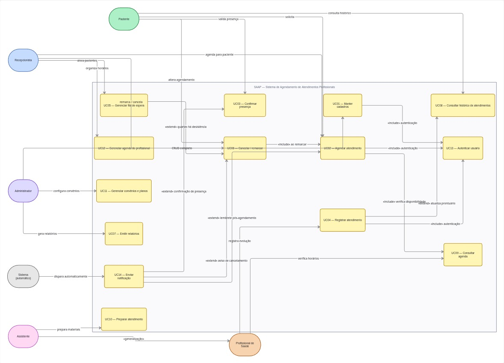
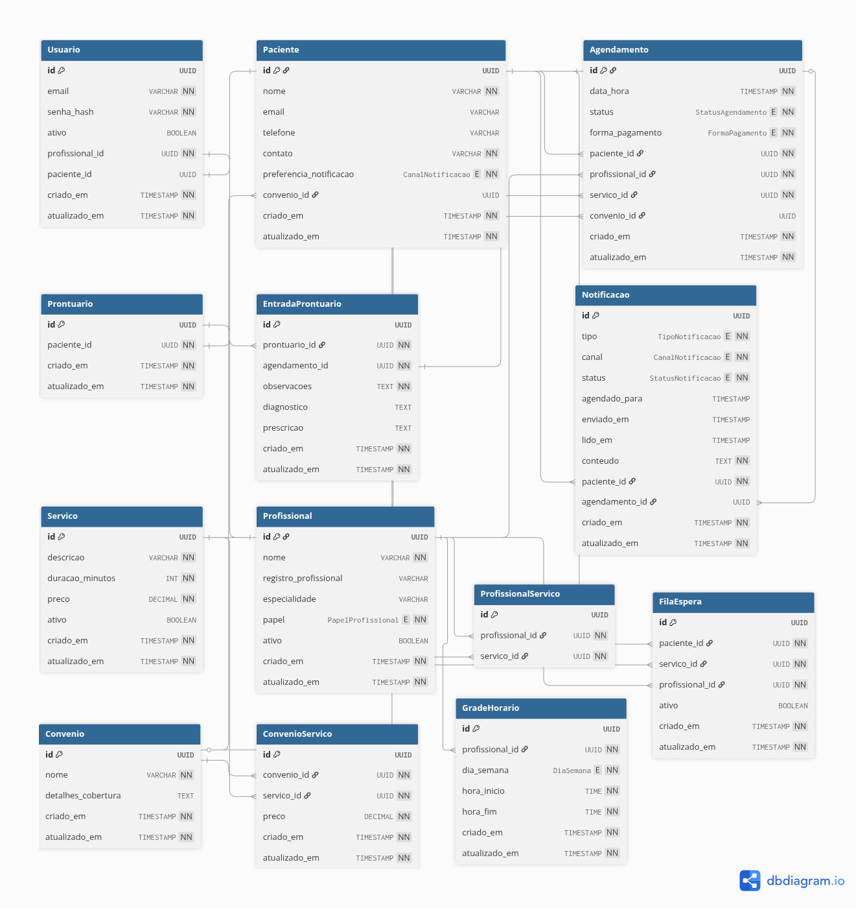
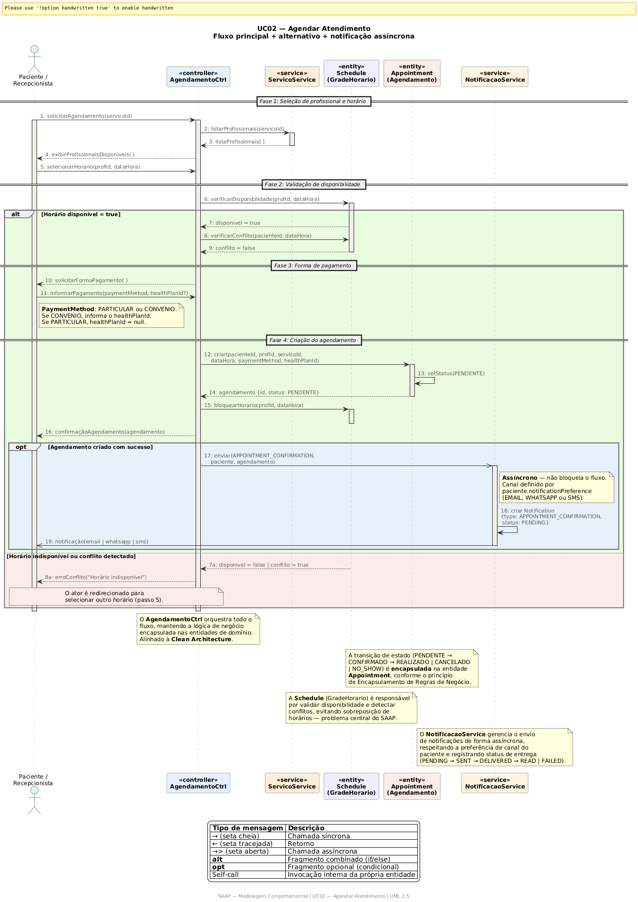

# Projeto SAAP (Sistema de Agendamento de Atendimentos Profissionais)

## Introdução

- **Contextos:**
  - Clínicas
  - Consultórios
  - Serviços especializados

## Visão do Problema

- **Situação:**
  - Muitos atendimentos ainda são gerenciados de forma manual ou pouco estruturada.
- **Problemas comuns:**
  - Conflito de horários
  - Falta de controle de agenda
  - Dificuldade de gestão de atendimentos

## Objetivo

O Projeto SAAP tem como objetivo estruturar um sistema de agendamento de atendimentos profissionais que reduza conflitos de horários, melhore o controle da agenda e apoie a gestão dos atendimentos de forma organizada e rastreável.

## Escopo

O escopo inicial contempla o cadastro de entidades principais, o agendamento e o gerenciamento do ciclo de vida dos atendimentos. O desenvolvimento será evolutivo ao longo da disciplina, com refinamento dos artefatos de análise, projeto e arquitetura.

## Funcionalidades Iniciais

**O sistema deverá permitir:**

- Cadastro de pacientes
- Cadastro de profissionais
- Cadastro de serviços (consulta, exame, etc.)
- Agendamento de atendimentos
- Cancelamento e remarcação
- Controle de horários disponíveis
- Check-in presencial e ordenação de atendimento por chegada no período
- **Confirmação de agendamento com follow-up proativo:** envio de mensagem de lembrete/confirmação quando o agendamento estiver dentro da janela configurável (ex: 48h antes), com solicitação de confirmação (sim/não). Caso não confirmado até 24h antes, alerta à recepção para contato e decisão (cancelar + reocupar vaga da lista de espera).

## Visão do Projeto

**O que vamos construir ao longo da disciplina:**

- Casos de uso
- Diagrama de classes (conceitual -> projeto)
- Diagramas de sequência
- Diagrama de estados
- Arquitetura do sistema

## Dinâmica

- **8 funcionalidades adicionais (proposta inicial):**
   - Notificações e Lembretes Automáticos: Envio de confirmações via E-mail ou WhatsApp para reduzir faltas.
   - **Confirmação de agendamento com follow-up proativo:** Envio de mensagem de confirmação (sim/não) quando o agendamento estiver dentro da janela configurável pelo administrador (ex: 48h antes). Se não confirmado até 24h antes, alerta à recepção para contato e decisão (cancelar + reocupar vaga da lista de espera). Responsabilidade: manter agenda cheia.
   - Prontuário Eletrônico / Histórico de Atendimento: Registro das notas e observações feitas pelo profissional durante cada sessão.
   - Gestão de Convênios e Planos: Configuração de diferentes formas de pagamento e cobertura para os atendimentos.
   - Lista de Espera Inteligente: Sistema que notifica pacientes interessados quando surge uma desistência em um horário concorrido.
   - Histórico de atendimentos por paciente: Fundamental para a continuidade do cuidado e organização clínica.
   - Relatórios de Desempenho: Visão analítica para o administrador (ex: taxa de cancelamento, faturamento por período e serviços mais procurados).
  - **Atendimento Prioritário (Lei Federal 10.048/2000):** Garantia de atendimento prioritário para grupos especiais definidos por lei (idosos 60+, gestantes, lactantes, pessoas com deficiência, TEA, mobilidade reduzida, obesos, doadores de sangue), com implementação de fila preferencial baseada em algoritmo de prioridade.
- **2 ou mais atores do sistema (proposta inicial):**
  - **Paciente:** pessoa que solicita atendimentos, acompanha seus agendamentos e confirma presença quando necessário.
  - **Profissional de Saúde:** ator responsável por executar os atendimentos e registrar as evoluções clínicas ou operacionais relacionadas ao serviço prestado.
  - **Assistente:** ator de apoio que auxilia na preparação do atendimento, organização de materiais e suporte ao fluxo operacional da clínica.
  - **Recepcionista:** ator que centraliza o relacionamento com a agenda, realizando agendamentos, remarcações, cancelamentos e suporte aos pacientes.
  - **Administrador:** ator com maior nível de permissão, responsável por cadastros, gestão de usuários, relatórios e configuração geral do sistema.

  Esses atores podem ser modelados com generalização e especialização quando fizer sentido no diagrama, especialmente para representar comportamentos comuns, como autenticação, identificação e permissões de acesso, sem perder as diferenças de responsabilidade de cada papel.

  Isso enriquecerá a Análise Orientada a Objetos, pois demonstra uma compreensão clara de permissões e responsabilidades (RBAC (Role-Based Access Control)).

## Critérios de Sucesso e Entregáveis

- Casos de uso documentados para os atores definidos
- Diagrama de classes conceitual evoluído para projeto
- Diagramas de sequência dos fluxos principais
- Diagrama de estados de uma entidade central do domínio
- Visão arquitetural do sistema com justificativas
- Protótipo funcional cobrindo as funcionalidades iniciais

## Modelagem Funcional (Casos de Uso)

Nesta etapa, o foco está em descrever o que o sistema faz do ponto de vista dos atores, consolidando os principais casos de uso do SAAP.

### Identificação dos Casos de Uso

| ID   | Caso de Uso                                     | Ator Principal           | Descrição Resumida                                                                                                                                                                        |
| ---- | ----------------------------------------------- | ------------------------ | ----------------------------------------------------------------------------------------------------------------------------------------------------------------------------------------- |
| UC01 | Manter Cadastro (Usuário/Paciente/Profissional) | Administrador            | Incluir, alterar, excluir e consultar dados cadastrais e de acesso.                                                                                                                       |
| UC02 | Agendar Atendimento                             | Paciente / Recepcionista | Selecionar profissional, serviço e período/slot disponível.                                                                                                                               |
| UC03 | Confirmar Presença                              | Paciente                 | Confirmar presença e realizar check-in presencial para entrada na fila de chegada.                                                                                                        |
| UC04 | Registrar Atendimento                           | Profissional             | Evolução do prontuário e histórico durante a consulta.                                                                                                                                    |
| UC05 | Gerenciar Fila de Espera                        | Recepcionista            | Alocar pacientes em desistências de horários.                                                                                                                                             |
| UC06 | Cancelar/Remarcar                               | Paciente / Recepcionista | Alterar o status de um agendamento existente.                                                                                                                                             |
| UC07 | Emitir Relatórios                               | Administrador            | Gerar dados de faturamento e produtividade.                                                                                                                                               |
| UC08 | Preparar Atendimento                            | Assistente               | Organizar materiais e preparar o ambiente para o atendimento.                                                                                                                             |
| UC09 | Atendimento Prioritário                         | Recepcionista / Paciente | Garantir prioridade de atendimento a grupos especiais (idosos 60+, gestantes, PcD, TEA, etc.) conforme Lei Federal 10.048/2000, utilizando fila preferencial com algoritmo de prioridade. |

### Regra Operacional de Atendimento por Período

- O agendamento é utilizado para planejar capacidade por período (ex.: manhã 08:00-11:00, intervalo de 1 hora entre atendimentos, capacidade de 4 pacientes).
- Mesmo com agendamento confirmado, o paciente deve realizar check-in presencial antes do último horário do período correspondente.
- Após o check-in presencial, o paciente entra em uma **fila de atendimento ordenada por prioridade legal + ordem de chegada**.
  - Prioridade legal (Lei 10.048/2000) tem precedência sobre FIFO.
  - Pacientes de mesma prioridade são atendidos por ordem de chegada (FIFO).
  - A fila é implementada como uma **fila prioritária (priority queue)** com heap binário (min-heap) e score composto.
- A ordem efetiva de atendimento no período é definida pela **ordem de prioridade (menor nível primeiro) + timestamp de check-in**.
- Pacientes sem check-in dentro do período seguem regra de ausência/no-show conforme política da clínica.
- Ao encerrar o período de atendimento, todo agendamento confirmado sem check-in presencial deve ser marcado automaticamente como NO_SHOW.

Figura - Diagrama de Casos de Uso (UML):



> Diagrama criado com [Miro](https://miro.com/app/board/uXjVGjm7Gus=/?moveToWidget=3458764667389215410&cot=14)

## Modelagem Estrutural (Classes Conceituais)

Nesta etapa, o objetivo é identificar as entidades centrais do domínio e seus relacionamentos, sem entrar em detalhes técnicos de implementação.

### Entidades Core (Domínio)

- **Usuário (User):** Representa a credencial de acesso ao sistema, concentrando autenticação, status de ativação e vínculo com perfis de negócio. Profissionais possuem login obrigatório; pacientes podem ter login opcional (não obrigatório).
- **Paciente (Patient):** Armazena dados pessoais, contato, preferência de notificação e histórico clínico.
- **Profissional (Professional):** Contém especialidade, registro profissional, papel (role) e vinculação a serviços. Possui flag de ativação (isActive) para desativação sem exclusão.
- **Serviço (Service):** Define o que é oferecido, como consulta ou exame, incluindo duração e valor. Possui flag de ativação (isActive) para desativação sem exclusão.
- **Agendamento (Appointment):** Classe central que relaciona Paciente, Profissional e Serviço em uma data e hora específica, incluindo forma de pagamento e vínculo opcional com convênio.
- **Agenda/Grade (Schedule):** Define os intervalos de tempo semanais em que um profissional está disponível, por dia da semana.
- **Prontuário (MedicalRecord / MedicalRecordEntry):** Registro cronológico de interações e observações clínicas de um paciente, com entradas vinculadas a cada atendimento.
- **Convênio (HealthPlan / HealthPlanPricing):** Regras de aceitação e tabelas de preços diferenciados por serviço para diferentes planos.
- **Notificação (Notification):** Registro de comunicações enviadas ao paciente (confirmações, lembretes, cancelamentos), com controle de canal, tipo e status de entrega.
- **Fila de Espera (WaitlistEntry):** Entrada que vincula um paciente a um serviço e profissional desejados, com ordenação FIFO para alocação automática em desistências.

### Relacionamentos Iniciais (Visão OO)

- Um Usuário é obrigatoriamente vinculado a um Profissional (1:1) e opcionalmente a um Paciente, permitindo que um profissional também seja paciente na mesma clínica.
- Pacientes podem operar sem login (padrão), com cadastro gerenciado pela recepção. A confirmação de presença (UC03) pode ocorrer por login opcional no sistema, por link de notificação (e-mail/WhatsApp) ou por contato com a recepção (WhatsApp/telefone), contemplando cenários de menores de idade, idosos ou dependentes.
- O vínculo entre Usuário e perfis de domínio permite aplicar RBAC com separação clara entre autenticação e regras de negócio.
- Um Agendamento possui exatamente um Paciente, um Profissional e um Serviço.
- Um Paciente pode ter N Agendamentos.
- Um Profissional possui uma Grade de horários (Schedule) composta por múltiplos intervalos semanais.
- Um Agendamento possui um Status: Pendente, Confirmado, Realizado, Cancelado ou No-show.
- Um Agendamento registra a forma de pagamento (particular ou convênio) e, quando aplicável, o convênio utilizado.
- Um Prontuário (MedicalRecord) é associado a um Paciente (1:1) e pode conter múltiplas entradas de atendimento (MedicalRecordEntry), cada uma vinculada a um Agendamento.
- Um Convênio (HealthPlan) pode ser associado a múltiplos Pacientes e definir tabelas de preços diferenciados (HealthPlanPricing) por Serviço.
- Uma Notificação é vinculada a um Paciente e opcionalmente a um Agendamento, registrando tipo, canal, status de entrega e conteúdo.
- Uma entrada na Fila de Espera (WaitlistEntry) vincula um Paciente a um Serviço e Profissional desejados, com ordenação FIFO.

Figura - Diagrama de Classes Conceituais:



> Diagrama criado com [dbdiagram.io](https://dbdiagram.io/d/Diagrama-SAAP-68f004372e68d21b41ab55a0) a partir de [saap_dbdiagram.dbml](assets/saap_dbdiagram.dbml)

## Justificativa da Abordagem Orientada a Objetos

Esta estrutura reforça a natureza orientada a objetos do projeto, pois organiza o domínio por responsabilidades, comportamentos e regras de negócio.

### Abstração e Especialização

Ao trabalhar com os diferentes papéis do sistema, aplicamos o conceito de especialização. Embora todos compartilhem características comuns, como identificação, autenticação e permissões, o comportamento muda conforme a função exercida. Um Profissional de Saúde possui recursos ligados à execução do atendimento, enquanto um Recepcionista atua diretamente sobre a agenda e os agendamentos de terceiros.

### Encapsulamento de Regras de Negócio

A lógica de transição de estados do agendamento permanece encapsulada na entidade Agendamento. Isso evita alterações inconsistentes de status e garante que regras como confirmação, cancelamento e conclusão do atendimento sejam tratadas de forma centralizada.

### Polimorfismo de Relacionamento

A entidade Serviço pode ser associada a diferentes perfis de profissionais, como médicos, enfermeiros e assistentes, por meio de relacionamentos flexíveis. Dessa forma, o sistema pode crescer sem exigir mudanças estruturais no núcleo do agendamento.

### Entidades e Objetos de Valor

Fica claro que Usuário, Paciente e Profissional são entidades, pois possuem identidade própria e ciclo de vida independente. Já o status do agendamento funciona como um objeto de valor ou enumeração de domínio, representando o estado atual do processo em um determinado momento.

### Baixo Acoplamento com a Arquitetura

Ao manter a lógica de negócio separada da persistência e da interface, o projeto adota uma base alinhada à Clean Architecture. Isso facilita manutenção, evolução e testes, além de proteger as regras do domínio contra dependências tecnológicas.

### Reflexão para o Projeto

Essa estrutura resolve de forma consistente os problemas de conflito de horários e falta de controle mencionados na visão do problema, pois permite validar regras de negócio antes da persistência e organizar o sistema com objetos bem definidos.

## Modelagem Comportamental (Diagramas de Sequência)

Nesta etapa, o foco é descrever a interação entre os objetos do sistema para realizar um caso de uso específico, detalhando a sequência de mensagens trocadas.

### Exemplo: Caso de Uso "Agendar Atendimento" (UC02)

1. O Paciente ou Recepcionista inicia o processo de agendamento.
2. O sistema exibe a lista de profissionais disponíveis para o serviço desejado.
3. O usuário seleciona um profissional e um período/slot disponível.
4. O sistema valida a disponibilidade da capacidade do período e confirma o agendamento.
5. O sistema envia uma notificação de confirmação com orientação de check-in presencial no período.

Figura - Diagrama de Sequência (UC02 - Agendar Atendimento):



> Diagrama criado com [PlantText](https://www.planttext.com?text=pLdTZjl65RxdKmpM5vNKzSQxpZgE46_3bQXT0Lf9a6GdQBSmHkH8ceJYi4DAZciRo5MlYo8FqA0NHGluokWJw4ty9FtEy6-ugnW5Sg5k0aJap3bpVhxpdJFCrqdATRfPXspgkkENNScNcg_vowduqqP4lkGldtSUdJdERzYpN_47SLBFFlxu4vlA91LhpWB1tAM80huMKQhCOuf7QHuJDjPg8PD4geZB1FA5PRIHZDlzcwmp6id2TgvCsrf-hTLEyhsCOevZsPpxto-rsaH1HuLAirShcGfhVSMZu9MMAGvd2nuczbgoue5w9QFblPL0BFWcJ7igIeU80pkQYgKIx7d_QF-cgVopOATdjc59bYZ1tZYCkLghLvc13yuw-CSjNf9qld3UE_VEQmkPsbEy6iY56CX8N2eT29qBN7v-UUP-QQ_U2SQ3tgdNyvvYnnXWahwCUPJML9HdMXjiX-ulfAz3mUOg3B1sXRFY_VhCKjq7y-fQSEo-fwahjx9uNmhOByrccV9G-iuxWlt7dtuyrByuVUnEPlrEV-mEPzwKDIW18HAGD0zicSFz57au6dDVej84--mscWXVn3uA5WNEZnXFc3iRJTW3xnJ9yXmdhZBCZhxwoaUujGf3eIykRYEB2Zgf3eruPpOPGFn9xxHtUKyy4NehVK6oK_DJPVyHHdJweWDKkfxNTUz9uWoPlZQ2_ae4cr3SHeqh3RnSAysrL4sZuchYTZqS3nsz-zPNIjmuLZ9AoNJeiVp8rBXNth1hREbuNtpAYw5AvKBwtESrJuQZMRy7-LxliVVey83i3Pv_EsBZINz8g1mS6eP80kgL6e3f17jwm6tK2pS_A1Ph6L7SG_PRniDKw8YdSglm5EM1t_rpzm-5a2Uxzv6lqNSSvzaprkC9QAADdXEAR0SQK5mrfv09jb9wzpE0mwXd6D0_lCZGsoRHH85Dm2dQ0aSZoxpg1qsg9RdbA28IhPv8WUCODL17Y6upzBcGoalNskDUPH1m799wM1dpE1UlIV-1_T49H5qkEnM2nfis-xpDn0zoBkldTcKIezot0YQmvZtNp-4weaQKm7LUMmqANJyuPW5FERrhLb66Soz0l04lunna1ymblSKpnRS8I5QVRVQapRP2cmpgRdt_diDADutu_q4zJToh6syu6p5tC6kpwm99cUUxzriHicromZegMeJIZ3G7BJYK3ZZHxL7iznhxZALw8npgmoP15lg-Q1S9hM-ycz6dLaOBlnjntcdkO6VFCL-scPzBuP1iv6BCGdYUUiOAuA4iUafdisNCb_b4Ic0hZAiguVIHLT16Qbn8c1fWx2u1W05ajA2TkjeQyzVquqQaAmMFLWA1NOr37lM3tnajO2N1j5okKgOM6JCm_BLQOrkorMhdCyBpWJjXQiCwe-4BRzWVdPZjKr6-E2wiOAfsNBcnqbEt1q6CDc58-q1VnZ0xUA26ZfP5pO90hQ7U3k55tWeH4HIw3n5TIsfHgoMN7Tz6P5cHREpuvPWrSKn5etIEoOGvq3xvCL4IfZoURfB662zHUbxJsclb3OxPlhoHP9oHHCnpqNTrP9KdtuNqARXm7YgCwfzYGik73AFxONiFaayon4iarwJ1xZEM2yRFm_87dLzHtcWCoXl-OlizjB4mGCLfCO7MRgi4Ns3TLxY0RNoH9CenPPJd_I8Vsv0Ra9w8jWHsTpmUzOSpSlqbYhBNdzoui_vecEEyg8LZLaiPBPKGC5gpa-hya2qmbb64MmPHjLfcC8eejXa09H70WcQYaroWmscCmJLJHX9EnKhd2uL99yM8bAALZxLO24rNpdnNmxjn-uDZzisrEvl2IMAXwSsqcQctAOFbONbenUTfpWKb3kYCs-XD-ZeMkDH_8cPsBVQ7L-_g9rJLWNvG6_4QOirboDxY3i_JXCSnVYRh90krLMzbiE62umYq4OpX7U_IkwmwdupitWV7oyuJY5JuAK2olnNoExtGj2aOOdKkqnx_DmPu2dK2j_coMnxjj_2eQYqABTQ87-VthCmr4uGHutIxs_sBQH58dKrmX0okkTbGZNNm6RUuQW86fQCOs7cptYvC22rFp6nh4oVrjuCFOyYuEsNUj-D1lmEOlN2dXnwtgbIPY55gKDxrkp9AN6aKTf9gpbA5F2biD1L-pDQuQ68tY9M5kmzBr00DEP5OxZuWWIP7Fe-JJSW3pYBSD-bYIxDpOkPljGQHICCKRYWZ-f35Td-73PrGy8YvsgVlO7wwqQBLEd6gX5iOCpqHyW0qZn9P3lSmcDILRPXz_ClV2DjvcNT7z89DF7VG_pqzlMKTTzZn1lYDRM-HhPVJwz4tJS9fgsNvWO14l7J4COnONT9RhMDJPHY5O65sBzozZqqmO9LNw2a_Iqx4KdCJZc4UjlsE5YtRnNd5bmMOKl-qa1KL5MIo-naLYVtWMxOrznvzxy8Z2XuXIYwu8JbcOelnazAQgBaMiQh2Ydr5CIQ6-Z5cp4FwuEh38Kr4hyp7sFrE58s4S7R_YmJSMHhkDqs4-beUDOjW_vD19nirhNP-Z9takSWjvx2CEad-8HSYVjQ7I6NHUH00BPQIe6syDPHlm0DVn9BOg97plq7B540oFxhUeF_2ctZT0aHT8AQ7FkLrcxRdXwQSWKVbuHwQPq91dCBcAaqnqX1I127kxJCsax6f0fH3Wi5aJU-w8a7FpX3trjGY1Rc1oHeeMs72Q9h100MxuciYbX84vVQ_vjkHM5zyXprDl9u8j9t8qdcHx-9peLEZjT9fGIiNQBLm8G14xJyaNVDbFhIfzLoQHjQGYy-eeJTBIGnwdv1KvhicmDb03GOoUoY4fo9SFFHv6DQ4-z5M5KEjZCpt9apwmFpk0oYdeYSeGUIp-3lEGW6Lcjr6vVykkL6124tWEseDgaWDCN6QNpxrsOkMRmRixEJSSRx6syqwTFuB) a partir de [saap_sequence_diagram_uc02.puml](assets/saap_sequence_diagram_uc02.puml)

### Exemplo: Caso de Uso "Confirmar Presença" (UC03)

1. O Paciente confirma presença para um agendamento específico.
2. A confirmação pode ocorrer por login opcional no sistema, por link de notificação (e-mail/WhatsApp) ou por contato com a recepção (WhatsApp/telefone).
3. O sistema atualiza o status do agendamento para "Confirmado".
4. Ao chegar na clínica, a recepção realiza o check-in presencial e o paciente é posicionado na fila ordenada por prioridade legal (Lei 10.048/2000) + ordem de chegada (FIFO para mesma prioridade).
5. O sistema notifica o profissional sobre a confirmação/check-in e registra o evento no histórico.

### Exemplo: Caso de Uso "Registrar Atendimento" (UC04)

1. O Profissional visualiza a fila presencial confirmada na sua tela, ordenada por chegada.
2. Ao clicar em **Chamar Paciente**, o sistema altera o status para **CALLING_PATIENT**.
3. Quando o paciente entra no consultório, o profissional clica em **Iniciar Atendimento** e o status muda para **IN_PROGRESS**.
4. O sistema libera a tela de prontuário para registro clínico.
5. Ao finalizar e fechar o prontuário, o sistema marca o atendimento como **COMPLETED**.
6. Após a finalização, a fila de pacientes pendentes volta a ser exibida para o próximo chamado.

### Exemplo: Caso de Uso "Manter Cadastro" (UC01)

1. O Administrador acessa o módulo de cadastros do sistema.
2. O sistema exibe as opções de gerenciamento (Usuários, Pacientes, Profissionais, Serviços).
3. O Administrador seleciona a entidade desejada e a operação (incluir, alterar, excluir ou consultar).
4. O sistema valida os dados informados (unicidade de e-mail, campos obrigatórios, formato do registro profissional).
5. O sistema persiste a operação e exibe a confirmação ao Administrador.

### Exemplo: Caso de Uso "Gerenciar Fila de Espera" (UC05)

1. A Recepcionista acessa a fila de espera para um determinado profissional e serviço.
2. O sistema exibe os pacientes cadastrados na fila, ordenados por data de entrada.
3. Quando ocorre uma desistência ou cancelamento, o sistema notifica automaticamente o primeiro paciente da fila.
4. O paciente confirma interesse no horário liberado.
5. O sistema cria o novo agendamento e remove o paciente da fila de espera.

> Observação: esta fila de espera é diferente da fila presencial de chegada.  
> Fila de espera = pré-agendamento por desistência; fila presencial = ordem de atendimento após check-in no local.

### Exemplo: Caso de Uso "Cancelar/Remarcar" (UC06)

1. O Paciente ou Recepcionista solicita o cancelamento ou remarcação de um agendamento existente.
2. O sistema verifica o status atual do agendamento (somente Pendente ou Confirmado podem ser alterados).
3. Em caso de cancelamento, o sistema atualiza o status para "Cancelado" e libera o horário na grade.
4. Em caso de remarcação, o sistema exibe os horários disponíveis do profissional.
5. O usuário seleciona o novo horário e o sistema cria um novo agendamento, cancelando o anterior.
6. O sistema envia notificação ao paciente e ao profissional sobre a alteração.

### Exemplo: Caso de Uso "Emitir Relatórios" (UC07)

1. O Administrador acessa o módulo de relatórios.
2. O sistema exibe os tipos disponíveis (faturamento por período, taxa de cancelamento, serviços mais procurados, produtividade por profissional).
3. O Administrador seleciona o tipo de relatório e o período desejado.
4. O sistema consulta os dados de agendamentos, atendimentos e faturamento.
5. O sistema gera e exibe o relatório com gráficos e indicadores consolidados.

### Exemplo: Caso de Uso "Preparar Atendimento" (UC08)

1. O Assistente consulta a agenda do dia para o profissional ao qual está vinculado.
2. O sistema exibe os atendimentos confirmados com detalhes do serviço e do paciente.
3. O Assistente registra a preparação dos materiais e do ambiente necessários.
4. O sistema atualiza o status da preparação, sinalizando ao profissional que o atendimento está pronto para iniciar.

### Exemplo: Caso de Uso "Atendimento Prioritário" (UC09)

1. O paciente pode **declarar** sua condição de prioridade já no momento do agendamento (online), mas essa declaração é **prévia e não definitiva**.
2. No **check-in presencial**, a recepcionista **sempre deve validar** a veracidade da condição declarada, solicitando documentação comprobatória quando necessário:
   - **Idoso (60+):** documento com foto que comprove idade.
   - **Gestante/Lactante:** cartão de gestante, exame ou declaração médica.
   - **Pessoa com deficiência/TEA/mobilidade reduzida:** laudo médico, CID, cartão de pessoa com deficiência (PcD) ou documento oficial.
   - **Doador de sangue:** comprovante de doação com data de validade (120 dias).
   - **Obesidade (IMC ≥ 40):** laudo médico com IMC calculado.
3. A recepcionista registra no sistema: `priorityLevel`, `priorityVerifiedBy` (seu ID), `priorityNotes` (observações), e `priorityDeclaredAt`.
4. O sistema calcula o `priorityScore` e insere o agendamento na **fila de atendimento prioritária**.
5. Se a documentação for insuficiente ou a condição não for comprovada, a recepcionista **redefine a prioridade para NORMAL**, registrando a justificativa em `priorityNotes`.
6. O sistema notifica o profissional sobre a prioridade validada (se aplicável) e registra o evento em log de auditoria.

### Fluxo de Confirmação de Agendamento com Follow-up Proativo

**Objetivo:** Reduzir taxas de no-show através de confirmação antecipada e follow-up administrativo quando o paciente não responde.

#### Configuração (Administrador)

O administrador define, nas configurações da clínica (`clinicSettings`):
- `confirmationWindowHours`: número de horas antes do agendamento que a **solicitação de confirmação** é enviada (padrão: 48h, opções: 24, 48, 72).
- `followUpDeadlineHours`: número de horas antes do agendamento que a **recepção deve ser notificada** se não houver confirmação (padrão: 24h).
- `confirmationChannels`: canais de envio da solicitação (email, WhatsApp, SMS).
- `autoCancelAfterNoResponse`: booleano — se `true`, cancelamento automático após `followUpDeadlineHours` sem resposta; se `false`, apenas alerta à recepção.
- `waitlistAutoFill`: booleano — se `true`, libera automaticamente vaga para o primeiro da lista de espera após cancelamento.

#### Fluxo Detalhado

1. **Agendamento criado:** `Appointment(status: CONFIRMED, scheduledAt: X)` — dataX criado em Y.
2. **Trigger de confirmação:** Quando `(scheduledAt - now()) ≤ confirmationWindowHours` **E** `confirmationStatus != CONFIRMED`, o sistema envia notificação de confirmação:
   - Canal: conforme `confirmationChannels`.
   - Conteúdo: "Confirme seu atendimento em [data/hora]. Responda **SIM** para confirmar ou **NÃO** para cancelar/remarcar."
   - O sistema registra `confirmationRequestedAt = now()` e `confirmationStatus = PENDING_RESPONSE`.
3. **Resposta do paciente:**
   - Se **SIM** dentro do prazo: `confirmationStatus = CONFIRMED`, `confirmationMethod = channel_used`, `confirmationAt = now()`.
   - Se **NÃO** dentro do prazo: `confirmationStatus = DECLINED`, sistema oferece opções de remarcação (fluxo UC06) ou cancelamento imediato.
4. **Ausência de resposta:** Se `(scheduledAt - now()) ≤ followUpDeadlineHours` **E** `confirmationStatus = PENDING_RESPONSE`:
   - Sistema envia **alerta à recepção** (dashboard, notificação interna).
   - Se `autoCancelAfterNoResponse = true` → status muda para `CANCELLED` (com motivo "Sem confirmação dentro do prazo").
   - Se `false` → a recepcionista assume responsabilidade de:
     a. Entrar em contato com o paciente (telefone/WhatsApp).
     b. Decidir: manter agendamento, remarcar ou cancelar.
     c. Se cancelar e `waitlistAutoFill = true`, **aciona automaticamente UC05 (Fila de Espera)** — notifica o primeiro da fila.
5. **Reocupação de vaga:** Quando o agendamento é cancelado por falta de confirmação:
   - `Appointment` vai para `CANCELLED`.
   - Se há fila de espera ativa para aquele `(professionalId, serviceId)`, o sistema notifica o paciente líder da fila (via notificação automática), oferecendo a vaga.
   - O paciente da fila tem um tempo configurável para resposta (ex: 12h). Se aceitar, é criado novo agendamento com `scheduledAt` igual ao slot liberado.
   - Se recusar ou não responder, segue para o próximo da fila.

#### Campos no Modelo Appointment (Extensão)

```prisma
model Appointment {
  // ...
  confirmationStatus     ConfirmationStatus @default(NOT_REQUESTED)
  confirmationRequestedAt DateTime?         // Quando a solicitação de confirmação foi enviada
  confirmationDeadline    DateTime?         // Prazo limite para confirmação (gerado a partir de confirmationWindowHours)
  confirmationAt         DateTime?         // Quando o paciente confirmou
  confirmationMethod     ConfirmationMethod? // Email, WhatsApp, SMS
  followUpRequired       Boolean           @default(false) // Requer intervenção da recepção
  followUpNotifiedAt     DateTime?         // Quando a recepção foi alertada
  // ...
}

enum ConfirmationStatus {
  NOT_REQUESTED    // Confirmação ainda não solicitada (agendamento recente)
  PENDING_RESPONSE // Solicitada, aguardando resposta do paciente
  CONFIRMED        // Paciente confirmou presença
  DECLINED         // Paciente declinou (cancelou/remarcará)
  NO_RESPONSE      // Não respondeu até o followUpDeadline
}
```

#### Integração com Outros Casos de Uso

- **UC03 (Confirmar Presença):** A confirmação de agendamento (SMS/e-mail) é uma **pré-confirmação** remota; o `CHECKIN_IN` presencial é a confirmação física no local. Ambas são rastreadas separadamente.
- **UC05 (Fila de Espera):** O cancelamento por falta de confirmação dispara automaticamente a Fila de Espera (se ativado).
- **UC06 (Cancelar/Remarcar):** A resposta "NÃO" à confirmação oferece interface de remarcação; o cancelamento automático por no-show de resposta usa a mesma lógica de cancelamento.
- **UC07 (Relatórios):** Deve incluir métricas de confirmação (taxa de resposta, taxa de no-show após follow-up, tempo médio de resposta).

#### Vantagens do Follow-up Proativo

- Redução de faltas por esquecimento.
- Ocupação mais eficiente da agenda (vagas ociosas são realocadas).
- Responsabilidade clara: recepcionista tem prazo definido para ação (`followUpRequired = true`).
- Configurabilidade por clínica (diferentes janelas de tempo).

### Base Legal e Fundamentação (UC09)

**Lei Federal 10.048/2000 (alterada pelas Leis 10.741/2003, 13.146/2015 e 14.626/2023):**

- Art. 1º - Garante atendimento prioritário às pessoas com deficiência, pessoas com transtorno do espectro autista (TEA), idosos (60+), gestantes, lactantes, pessoas com criança de colo, obesos, pessoas com mobilidade reduzida e doadores de sangue (com comprovante válido de 120 dias).
- Art. 2º - Exige que repartições públicas e empresas concessionárias de serviços públicos dispensem atendimento individualizado e imediato a essas pessoas.
- **Âmbito de aplicação:** O SAAP, como sistema de saúde privado, está obrigado a cumprir o disposto no Art. 2º da Lei 10.048/2000, pois se enquadra como "empresa concessionária de serviços públicos" na área de saúde, além de submeter-se à legislação consumerista (CDC) e à Lei de Acessibilidade (Lei 13.146/2015 - Estatuto da Pessoa com Deficiência).

## Modelagem de Estados (Diagrama de Estados)

Nesta etapa, o objetivo é descrever os diferentes estados que uma entidade central do domínio pode assumir ao longo de seu ciclo de vida, bem como as transições entre esses estados.

### Exemplo: Entidade "Agendamento"

**Estados:**
- Pendente: O agendamento foi criado, mas ainda não foi confirmado.
- Confirmado: O paciente confirmou que comparecerá ao atendimento.
- **Check-in Realizado:** O paciente chegou à clínica e realizou o check-in presencial. Neste momento, a recepcionista **valida obrigatoriamente** a condição de prioridade (se declarada) com documentação comprobatória. O `priorityLevel` é confirmado ou redefinido para `NORMAL` se a comprovação falhar. O agendamento é inserido na fila prioritária com `priorityScore` calculado e o evento é registrado em log de auditoria.
- Chamando Paciente: O profissional chamou o próximo paciente da fila presencial.
- Em Atendimento: O paciente entrou no consultório e o prontuário foi iniciado.
- Realizado: O atendimento foi concluído com sucesso.
- Cancelado: O agendamento foi cancelado pelo paciente ou pela recepção.
- No-show: O paciente não compareceu ao atendimento confirmado sem aviso prévio.

**Transições:**
- De Pendente para Confirmado: O paciente confirma a presença.
- **De Confirmado para Check-in Realizado:** O paciente realiza check-in presencial na recepção. Nesta etapa, a recepcionista **valida a prioridade declarada** (se houver) com documentação, registra `priorityLevel` definitivo, `priorityVerifiedBy`, `priorityNotes` e `priorityDeclaredAt`. O sistema calcula o `priorityScore` e insere o agendamento na fila prioritária.
- De Check-in Realizado para Chamando Paciente: O profissional clica em chamar paciente da fila (selecionado pela priority queue).
- De Chamando Paciente para Em Atendimento: O paciente entra no consultório e o profissional inicia o atendimento.
- De Em Atendimento para Realizado: O profissional finaliza e fecha o prontuário.
- De Pendente para Cancelado: O paciente ou recepção cancela o agendamento.
- De Confirmado para Cancelado: O paciente ou recepção cancela o agendamento após confirmação.
- De Confirmado para No-show: O horário do atendimento passou e o paciente não compareceu nem cancelou.
- De Check-in Realizado para Cancelado (caso especial): Paciente chega mas desiste antes de ser chamado (com justificativa).
- Remarcação: deve gerar um novo agendamento (com novo ID), mantendo o original no histórico.
- Estados finais de trilha operacional: Realizado, Cancelado e No-show não retornam para Pendente.

**Nota sobre Check-in e Fila Prioritária (UC09):**
O estado `Check-in Realizado` é crítico para o atendimento prioritário. Neste momento:
1. A condição de prioridade (se aplicável) é verificada e registrada pela recepção.
2. O `priorityScore` é calculado e o agendamento é inserido na **fila prioritária (priority queue)**.
3. A ordem de chamada subsequente segue o algoritmo de heap: pacientes com prioridade menor (P1) são extraídos primeiro, seguidos por P2, P3, etc., mantendo FIFO dentro de cada nível.

## Algoritmo de Fila Prioritária (UC09)

### Conceito e Fundamentação Teórica

**Algoritmo de Fila Prioritária (Priority Queue):**
Uma fila prioritária é uma estrutura de dados onde cada elemento possui uma prioridade associada. Diferente da fila comum (FIFO — First In, First Out), a prioridade determina a ordem de atendimento, permitindo que elementos com maior prioridade sejam removidos primeiro. É uma fila ordenada, implementada frequentemente com **heaps binários (binary heaps)**, onde as operações de inserção (enqueue) e remoção (dequeue) são executadas em **O(log n)**.

**Heap Binário (Binary Heap):**

- É uma árvore binária completa que satisfaz a **propriedade de heap**: cada nó pai possui prioridade maior ou igual a seus filhos (max-heap) ou menor ou igual (min-heap).
- Armazenado compactamente em um array, sem necessidade de ponteiros.
- No SAAP, utilizaremos um **min-heap** onde a prioridade é representada por valor numérico (quanto menor o valor, maior a prioridade — ex.: 1 = Emergencial, 5 = Normal).

**Operações Fundamentais:**

- `insert(element, priority)`: O(log n) — insere e reorganiza o heap (bubble-up/sift-up).
- `extract_min()` ou `extract_max()`: O(log n) — remove o elemento prioritário e reorganiza (bubble-down/sift-down).
- `peek()`: O(1) — retorna o elemento prioritário sem removê-lo.
- `change_priority(element, new_priority)`: O(log n) — altera prioridade e reordena.

### Níveis de Prioridade (Base Legal Lei 10.048/2000)

O SAAP implementa a seguinte hierarquia de prioridades para atendimento:

| Nível  | Valor | Descrição                                               | Base Legal / Critério                                                  |
| ------ | ----- | ------------------------------------------------------- | ---------------------------------------------------------------------- |
| **P1** | 1     | Pessoa com deficiência física, intelectual ou sensorial | Lei 10.048/2000 + Lei 13.146/2015 (Estatuto da Pessoa com Deficiência) |
| **P1** | 1     | Pessoa com Transtorno do Espectro Autista (TEA)         | Lei 10.048/2000 (alterada pela Lei 14.626/2023)                        |
| **P1** | 1     | Pessoa com mobilidade reduzida                          | Lei 14.626/2023                                                        |
| **P2** | 2     | Idoso (60 anos ou mais)                                 | Lei 10.048/2000 (Estatuto do Idoso - Lei 10.741/2003)                  |
| **P2** | 2     | Doador de sangue (com comprovante válido de 120 dias)   | Lei 10.048/2000 (Lei 14.626/2023)                                      |
| **P3** | 3     | Gestante                                                | Lei 10.048/2000                                                        |
| **P3** | 3     | Lactante                                                | Lei 10.048/2000                                                        |
| **P3** | 3     | Pessoa com criança de colo                              | Lei 10.048/2000                                                        |
| **P4** | 4     | Pessoa com obesidade (IMC ≥ 40)                         | Lei 13.146/2015                                                        |
| **P5** | 5     | Paciente sem prioridade legal (atendimento regular)     | —                                                                      |

**Regras de Desempate (same priority):** FIFO (ordem de chegada/check-in). Para assegurar isso, utiliza-se um **timestamp de check-in** como critério secundário na ordenação do heap.

### Complexidade Algorítmica

| Operação                      | Estrutura Heap | Estrutura Array (ordenado)              |
| ----------------------------- | -------------- | --------------------------------------- |
| Inserção (enqueue)            | O(log n)       | O(n) — precisa reorganizar todo o array |
| Remoção prioritária (dequeue) | O(log n)       | O(1) — sempre o primeiro elemento       |
| Consulta ao topo (peek)       | O(1)           | O(1)                                    |
| Busca por elemento            | O(n)           | O(log n) com busca binária              |
| Alteração de prioridade       | O(log n)       | O(n) — precisa reordenar                |

**Conclusão:** O **heap binário** é a implementação mais eficiente para a fila prioritária do SAAP, pois temos:

- Inserções frequentes (check-in de pacientes)
- Remoções frequentes (chamada para atendimento)
- Necessidade de manter ordem por prioridade + FIFO tie-breaker

**Figura - Heap Binário (Min-Heap) representando a Fila Prioritária:**

```
        (P1, 08:30) score: 1.083001e15  ← root (topo da fila)
           /          \
(P1, 08:35) score:1.083005e15   (P2, 08:20) score:2.083020e15
      /        \                  /          \
(P2, 08:25)  (P3, 08:40)      (P3, 08:45)  (P5, 08:50)
```

_Cada nó armazena: `(priorityLevel, timestampCheckIn)`. O heap garante que o nó raiz sempre tenha o menor score (maior prioridade). Inserções e remoções reordenam a árvore em O(log n)._

### Aplicação no SAAP — Fluxo de Atendimento

1. **Check-in Presencial:**
   - Paciente chega à clínica e informa condição de prioridade (se aplicável) — pode já ter declarado no agendamento online.
   - **Recepcionista valida obrigatoriamente** a condição com documentação comprobatória (laudo, cartão, documento com idade, comprovante de doação, etc.).
   - Se válida: `priorityLevel` é mantido/definido, `priorityVerifiedBy` recebe o ID da recepcionista, `priorityNotes` registra tipo de documento.
   - Se inválida/não comprovada: `priorityLevel` é **redefinido para NORMAL**, com justificativa em `priorityNotes`.
   - Sistema registra `checkedInAt` e `priorityDeclaredAt`, calcula `priorityScore` e insere o agendamento na **fila de atendimento prioritária (Priority Queue)** com score composto:
     ```
     score = (priorityLevel × 10^12) + (timestampCheckInEmMilissegundos)
     ```
   - Esse score garante que: (a) prioridade menor (P1) vem primeiro; (b) mesma prioridade → ordem de chegada (FIFO).

2. **Ordenação da Fila Presencial:**
   - A fila é **mantida** como um **min-heap** ordenado por `score`.
   - Quando o profissional clica **"Chamar próximo paciente"**, o sistema faz `extract_min()` da priority queue.
   - O paciente com menor score (P1 mais antigo, ou P2 mais antigo, etc.) é selecionado.
   - O agendamento tem status alterado para `CALLING_PATIENT`, depois `IN_PROGRESS` quando iniciado.

3. **Atendimento Não-Prioritário:**
   - Quando não há pacientes prioritários, a fila normal (FIFO) é usada.
   - A priority queue comporta todos os pacientes, permitindo mistura de níveis.

4. **Update Dinâmico de Prioridade:**
   - Se um paciente com prioridade P5 (normal) declarar condição de prioridade no check-in (ex.: idoso), sua prioridade é **aumentada** (valor numérico diminui).
   - O sistema recalcula seu `score` e chama `increase_priority()` (bubble-up no heap), reposicionando-o automaticamente.
   - Isso evita que pacientes sem declaração prévia fiquem em desvantagem.

### Modelagem de Dados — Prisma Schema (Extensão)

```prisma
enum PriorityLevel {
  EMERGENCY    // P1 — deficiência, TEA, mobilidade reduzida (atendimento imediato)
  HIGH         // P2 — idoso 60+, doador de sangue
  MEDIUM       // P3 — gestante, lactante, criança de colo
  ELEVATED     // P4 — obesidade
  NORMAL       // P5 — sem prioridade legal
}

model Appointment {
  // ... (campos existentes)
  priorityLevel     PriorityLevel   @default(NORMAL)
  priorityScore     BigInt?         // Score composto para ordenação (não indexado diretamente)
  priorityDeclaredAt DateTime?      // Momento da declaração de prioridade
  priorityVerifiedBy String?        // ID do usuário que verificou (recepcionista)
  priorityNotes     String?         // Observações (ex.: laudo, comprovante)
  // ...
}
```

**Justificativa do `priorityScore`:** Armazenamos o score calculado (prioridade × 10^12 + timestamp) para permitir ordenação eficiente no banco via `ORDER BY priorityScore ASC`. Isso permite consultas SQL otimizadas sem carregar toda a heap na aplicação.

### Considerações de Auditoria e Conformidade

- **Log imutável:** Toda alteração de prioridade deve ser auditada (quem alterou, quando, com qual justificativa, e qual documento foi apresentado).
- **Validação obrigatória no check-in:** A declaração de prioridade feita durante o agendamento (online) é **prévia e não vinculativa**. No check-in presencial, a recepcionista **deve** validar a condição com documentação comprobatória. Sem comprovação, a prioridade é definida como `NORMAL`.
- **Comprovante de prioridade:** Para doadores de sangue, exigir upload do comprovante no sistema (validade 120 dias). Para outros grupos, documento físico pode ser verificável no ato.
- **Tratamento de fraudes:** Recepcionista pode reverter prioridade se declarada indevidamente, com registro de motivo. Múltiplas reverteres podem acionar alerta dePossible abuso.
- **Relatórios:** UC07 deve gerar estatísticas de atendimentos prioritários (% por tipo, tempo médio de espera por prioridade, taxa de comprovação documental).
- **Retroatividade:** Se um paciente for chamado da fila (`CALLING_PATIENT`) e não tiver comprovado a prioridade, a prioridade é redefinida para `NORMAL` e o tempo de espera é recalculado (sem efeito retroativo na ordem já chamada).
- **Acompanhantes:** Leitores do Art. 1º, §1º da Lei 10.048/2000 — acompanhantes de pessoas com prioridade são atendidos **juntamente e acessoriamente** (mesmo nível de prioridade do titular).

## Requisitos Não Funcionais (RNF)

- **LGPD e privacidade:** dados sensíveis com minimização de coleta, base legal definida, controle de acesso por perfil, registro de consentimento quando aplicável e trilha de auditoria de acesso/alteração.
- **Segurança:** autenticação com hash de senha forte, proteção de sessão/token, autorização por papel (RBAC), validação de entrada e proteção contra abuso (rate limit) em endpoints críticos.
- **Auditoria e rastreabilidade:** log de eventos de negócio (criação, confirmação, remarcação, cancelamento, no-show), com data/hora, ator/origem e correlação entre agendamento original e remarcado.
- **Concorrência de agenda:** prevenção de double-booking por validação transacional e unicidade de slot por profissional/data-hora.
- **Conformidade com Lei 10.048/2000:** implementação de fila prioritária com algoritmo de prioridade, registro auditável de cada atendimento prioritário (nível, comprovante, usuário que verificou) e garantia de atendimento imediato após o serviço em andamento, conforme Art. 2º da lei.
- **Disponibilidade e backup:** rotina de backup periódico, política de retenção e procedimento de restauração testado.
- **Observabilidade:** logs estruturados, métricas operacionais e monitoramento de falhas para notificação de incidentes.

## Priorização do MVP (proposta)

- **MVP obrigatório (primeira entrega funcional):**
  - UC01 Manter Cadastro (Paciente, Profissional, Serviço)
  - UC02 Agendar Atendimento (com validação de conflito de horário)
  - UC03 Confirmar Presença (login opcional, link de notificação ou recepção)
  - UC06 Cancelar/Remarcar (remarcação sempre como novo agendamento)
  - Estados de Agendamento (Pendente, Confirmado, Realizado, Cancelado, No-show)
  - Notificações básicas de confirmação/cancelamento
  - Controle de acesso por papel (Administrador, Recepcionista, Profissional)

- **Incremental (pós-MVP):**
  - UC04 Registrar Atendimento + prontuário detalhado
  - UC05 Fila de Espera Inteligente
  - UC07 Relatórios analíticos avançados
  - UC08 Preparar Atendimento
  - UC09 Atendimento Prioritário (Lei 10.048/2000)
  - **Confirmação de agendamento com follow-up proativo (extensão UC03/UC06)**
  - Gestão de Convênios e regras de preço por serviço
  - Observabilidade avançada e automações de lembrete

## Diagrama de Classes Conceituais (Domínio)

> **Nota:** Esta seção aprofunda tecnicamente a Modelagem Estrutural apresentada anteriormente, detalhando o schema de dados completo com sintaxe Prisma. Está posicionada ao final do documento por ser um artefato técnico de referência, consultado após a compreensão do domínio e das regras de negócio.

Diferente do diagrama de classes de projeto, o diagrama conceitual foca em representar as entidades do domínio e seus relacionamentos de forma abstrata, sem detalhes de implementação. Seguindo o padrão de projeto SOLID, as classes são organizadas para refletir a lógica de negócio e as regras do domínio, facilitando a evolução do sistema ao longo do desenvolvimento.

Figura - Esquema de dados consolidado do domínio:


> Diagrama criado com [Figma](https://www.figma.com/design/bNqm2RfZUY3HJP7DRy0BZZ/Untitled?node-id=7-2)

### Estrutura das Entidades (Domain Layer)

Abaixo, represento como essas classes seriam estruturadas logicamente:

```prisma
// schema.prisma

datasource db {
  provider = "postgresql" // Ou o banco de sua preferência (mysql, sqlserver)
  url      = env("DATABASE_URL")
}

generator client {
  provider = "prisma-client-js"
}

model User {
  id            String   @id @default(uuid())
  email         String   @unique
  passwordHash  String   // Hash da senha (BCrypt)
  isActive      Boolean  @default(true)

  // Relacionamento OBRIGATÓRIO com Professional (1:1)
  // Todo usuário do sistema é um profissional (Admin, Recepcionista, Médico, etc.)
  professional   Professional @relation(fields: [professionalId], references: [id])
  professionalId String       @unique

  // Relacionamento opcional com o perfil de paciente
  // Permite que um profissional também seja paciente na mesma clínica
  // NOTA: Pacientes podem operar sem login (padrão), com cadastro gerenciado
  // pela recepção/administração. A confirmação de presença (UC03) pode ocorrer
  // por login opcional, por links em notificações (e-mail/WhatsApp) ou por
  // contato com a recepção (WhatsApp/telefone), contemplando cenários em que
  // o paciente é menor de idade, idoso ou dependente de responsável.
  patient        Patient?      @relation(fields: [patientId], references: [id])
  patientId      String?       @unique

  createdAt DateTime @default(now())
  updatedAt DateTime @updatedAt
}

model Patient {
  id                    String               @id @default(uuid())
  name                  String
  email                 String?              // Para notificações por e-mail
  phone                 String?              // Para notificações por WhatsApp/SMS
  contact               String
  dateOfBirth           DateTime?            // Para cálculo automático de prioridade por idade (60+)
  notificationPreference NotificationChannel @default(EMAIL)
  // Dados sensíveis (deficiência, TEA, mobilidade) são declarados por atendimento, não no cadastro, conforme LGPD
  // Relação inversa opcional
  user                  User?
  appointments          Appointment[]        // 1:N Relationship
  medicalRecord         MedicalRecord?       // 1:1 com Prontuário
  notifications         Notification[]       // Histórico de notificações
  waitlistEntries       WaitlistEntry[]      // Entradas na fila de espera
  healthPlan            HealthPlan?          @relation(fields: [healthPlanId], references: [id])
  healthPlanId          String?
  createdAt             DateTime             @default(now())
  updatedAt             DateTime             @updatedAt
}

model Professional {
  id             String            @id @default(uuid())
  name           String
  // Opcional para profissionais sem conselho de classe (ex: Assistentes)
  licenseNumber  String?           @unique // Equivalent to "registroProfissional"
  // Define o papel do profissional no sistema
  role           ProfessionalRole  @default(PRACTITIONER)
  specialty      String?
  isActive       Boolean           @default(true) // Desativar sem excluir

  // Relação inversa obrigatória
  user           User
  services       Service[]         // Relationship N:N (Many professionals can do the same service)
  appointments   Appointment[]
  schedules      Schedule[]        // 1:N Grade de horários disponíveis
  waitlistEntries WaitlistEntry[]  // Entradas na fila de espera
  createdAt      DateTime          @default(now())
  updatedAt      DateTime          @updatedAt
}

// ──────────────────────────────────────────────
// Cadastro da Clínica (Entity Master)
// ──────────────────────────────────────────────

model Clinic {
  id                    String   @id @default(uuid())
  name                  String   // Nome fantasia da clínica
  legalName             String?  // Razão social (opcional)
  cnpj                  String?  @unique // CNPJ (opcional para clínicas de pessoa jurídica)
  cpf                   String?  @unique // CPF (para clínicas de pessoa física)
  phone                 String?  // Telefone principal
  email                 String?  // E-mail oficial
  // Endereço
  street                String?
  number                String?
  complement            String?
  neighborhood          String?
  city                  String?
  state                 String?
  zipCode               String?
  // Responsável legal / diretor clínico (opcional — pode ser um Professional cadastrado)
  responsibleProfessional   Professional? @relation(fields: [responsibleProfessionalId], references: [id])
  responsibleProfessionalId String?
  // Configurações específicas da clínica (1:1) — FK mantida em ClinicSettings
  settings              ClinicSettings?
  // Meta
  createdAt             DateTime        @default(now())
  updatedAt             DateTime        @updatedAt
}

model Service {
  id               String              @id @default(uuid())
  description      String              // Ex: "Consultation", "Exam"
  durationMinutes  Int
  price            Decimal             @db.Decimal(10, 2)
  isActive         Boolean             @default(true) // Desativar sem excluir
  professionals    Professional[]      // M:N Relationship
  appointments     Appointment[]
  healthPlans      HealthPlan[]        // N:N com Convênios
  pricingRules     HealthPlanPricing[] // Preços por convênio
  waitlistEntries  WaitlistEntry[]     // Entradas na fila de espera
  createdAt        DateTime            @default(now())
  updatedAt        DateTime            @updatedAt
}

model Appointment {
  id             String            @id @default(uuid())
  scheduledAt    DateTime          // Data/hora de referência do slot
  periodLabel    String?           // Ex: "MANHA", "TARDE", "NOITE"
  status         AppointmentStatus @default(PENDING)
  checkedInAt    DateTime?         // Check-in presencial
  arrivalOrder   Int?              // Ordem de chegada confirmada no período
  calledAt       DateTime?         // Momento em que o paciente foi chamado
  startedAt      DateTime?         // Início do atendimento no consultório
  completedAt    DateTime?         // Término do atendimento

   // Atendimento Prioritário (Lei Federal 10.048/2000)
   priorityLevel        PriorityLevel @default(NORMAL)       // Nível de prioridade legal (sempre definido)
   priorityScore        BigInt?                              // Score composto (priority × 10^12 + timestamp check-in)
   priorityDeclaredAt   DateTime?                            // Quando a prioridade foi declarada/check-in
   priorityVerifiedBy   String?                              // ID do usuário que verificou (recepcionista/admin)
   priorityNotes        String?                              // Observações (laudo, comprovante, justificativa)

   // Confirmação de agendamento com follow-up proativo
   confirmationStatus     ConfirmationStatus @default(NOT_REQUESTED) // Status da solicitação de confirmação
   confirmationRequestedAt DateTime?                                 // Quando a solicitação de confirmação foi enviada
   confirmationDeadline    DateTime?                                 // Prazo limite para confirmação (gerado com base em confWindowHours)
   confirmationAt         DateTime?                                 // Quando o paciente confirmou
   confirmationMethod     ConfirmationMethod?                       // Email, WhatsApp, SMS
   followUpRequired       Boolean           @default(false)        // Requer intervenção da recepção
   followUpNotifiedAt     DateTime?                                 // Quando a recepção foi alertada

   // Relationships
  patient        Patient           @relation(fields: [patientId], references: [id])
  patientId      String

  professional   Professional      @relation(fields: [professionalId], references: [id])
  professionalId String

  service        Service           @relation(fields: [serviceId], references: [id])
  serviceId      String

  // Forma de pagamento do atendimento
  paymentMethod  PaymentMethod     @default(PRIVATE)
  healthPlan     HealthPlan?       @relation(fields: [healthPlanId], references: [id])
  healthPlanId   String?           // Null = particular

  medicalRecordEntry MedicalRecordEntry? // Registro do prontuário vinculado
  notifications      Notification[]      // Notificações enviadas sobre este agendamento

  createdAt      DateTime          @default(now())
  updatedAt      DateTime          @updatedAt
}

enum AppointmentStatus {
  PENDING
  CONFIRMED
  CHECKED_IN
  CALLING_PATIENT
  IN_PROGRESS
  COMPLETED
  CANCELLED
  NO_SHOW
}

enum PaymentMethod {
  PRIVATE       // Atendimento particular
  HEALTH_PLAN   // Cobertura por convênio
}

enum DayOfWeek {
  SUNDAY
  MONDAY
  TUESDAY
  WEDNESDAY
  THURSDAY
  FRIDAY
  SATURDAY
}

enum ProfessionalRole {
  PRACTITIONER    // Médico, Fisioterapeuta, etc.
  NURSE           // Enfermeira
  ASSISTANT       // Assistente de instrumentação
  ADMINISTRATOR   // Administrador da clínica
  RECEPTIONIST    // Recepcionista
}

// ─────────────────────────────────────────────────────────────────────────────
// Atendimento Prioritário — Lei Federal 10.048/2000 (alterada 2023)
// Define os níveis de prioridade de atendimento baseados em grupos legais
// ─────────────────────────────────────────────────────────────────────────────
enum PriorityLevel {
  EMERGENCY   // P1 — Pessoa com deficiência, TEA, mobilidade reduzida (atendimento imediato)
  HIGH        // P2 — Idoso (60+), doador de sangue (comprovante 120 dias)
  MEDIUM      // P3 — Gestante, lactante, pessoa com criança de colo
  ELEVATED    // P4 — Pessoa com obesidade (IMC ≥ 40)
  NORMAL      // P5 — Sem prioridade legal (atendimento regular)
}

// Confirmação de agendamento com follow-up proativo
// ─────────────────────────────────────────────────────────────────────────────
enum ConfirmationStatus {
  NOT_REQUESTED    // Confirmação ainda não solicitada (agendamento recente)
  PENDING_RESPONSE // Solicitada, aguardando resposta do paciente
  CONFIRMED        // Paciente confirmou presença (via link/e-mail/WhatsApp)
  DECLINED         // Paciente declinou (solicitou cancelamento/remarcação)
  NO_RESPONSE      // Não respondeu até o followUpDeadline (alerta recepção)
}

enum ConfirmationMethod {
  EMAIL
  WHATSAPP
  SMS
  PHONE_CALL      // Ligações da recepção (follow-up manual)
  DASHBOARD       // Confirmação via painel do paciente/app
}

// ──────────────────────────────────────────────
// Agenda/Grade de Horários do Profissional
// ──────────────────────────────────────────────

model Schedule {
  id             String       @id @default(uuid())
  dayOfWeek      DayOfWeek    // Dia da semana
  startTime      String       // Ex: "08:00"
  endTime        String       // Ex: "17:00"
  professional   Professional @relation(fields: [professionalId], references: [id])
  professionalId String
  createdAt      DateTime     @default(now())
  updatedAt      DateTime     @updatedAt
}

// ──────────────────────────────────────────────
// Prontuário Eletrônico / Histórico de Atendimento
// ──────────────────────────────────────────────

model MedicalRecord {
  id        String               @id @default(uuid())
  patient   Patient              @relation(fields: [patientId], references: [id])
  patientId String               @unique // 1:1 com Paciente
  entries   MedicalRecordEntry[]
  createdAt DateTime             @default(now())
  updatedAt DateTime             @updatedAt
}

model MedicalRecordEntry {
  id              String        @id @default(uuid())
  notes           String        // Observações clínicas
  diagnosis       String?       // Diagnóstico (opcional)
  prescription    String?       // Prescrição (opcional)
  medicalRecord   MedicalRecord @relation(fields: [medicalRecordId], references: [id])
  medicalRecordId String
  appointment     Appointment   @relation(fields: [appointmentId], references: [id])
  appointmentId   String        @unique // Cada entrada vinculada a um atendimento
  createdAt       DateTime      @default(now())
  updatedAt       DateTime      @updatedAt
}

// ──────────────────────────────────────────────
// Gestão de Convênios e Planos
// ──────────────────────────────────────────────

model HealthPlan {
  id              String              @id @default(uuid())
  name            String              // Ex: "Unimed", "SulAmérica"
  coverageDetails String?             // Detalhes de cobertura
  patients        Patient[]
  services        Service[]           // Serviços cobertos pelo convênio
  pricingRules    HealthPlanPricing[] // Tabela de preços por serviço
  appointments    Appointment[]       // Atendimentos cobertos
  createdAt       DateTime            @default(now())
  updatedAt       DateTime            @updatedAt
}

// Tabela de preços diferenciados por convênio e serviço
model HealthPlanPricing {
  id           String     @id @default(uuid())
  healthPlan   HealthPlan @relation(fields: [healthPlanId], references: [id])
  healthPlanId String
  service      Service    @relation(fields: [serviceId], references: [id])
  serviceId    String
  price        Decimal    @db.Decimal(10, 2) // Preço cobrado pelo convênio (pode diferir do particular)
  createdAt    DateTime   @default(now())
  updatedAt    DateTime   @updatedAt

  @@unique([healthPlanId, serviceId]) // Um preço por combinação convênio+serviço
}

// ──────────────────────────────────────────────
// Fila de Espera Inteligente
// ──────────────────────────────────────────────

model WaitlistEntry {
  id             String       @id @default(uuid())
  patient        Patient      @relation(fields: [patientId], references: [id])
  patientId      String
  service        Service      @relation(fields: [serviceId], references: [id])
  serviceId      String
  professional   Professional @relation(fields: [professionalId], references: [id])
  professionalId String
  isActive       Boolean      @default(true)
  createdAt      DateTime     @default(now()) // Usado para ordenação FIFO
  updatedAt      DateTime     @updatedAt
}

// ──────────────────────────────────────────────
// Notificações e Lembretes Automáticos
// ──────────────────────────────────────────────

model Notification {
  id            String             @id @default(uuid())
  type          NotificationType   // Tipo da notificação
  channel       NotificationChannel // Canal utilizado (e-mail, WhatsApp, SMS)
  status        NotificationStatus @default(PENDING)
  scheduledFor  DateTime?          // Para lembretes agendados (ex: 24h antes)
  sentAt        DateTime?          // Quando foi efetivamente enviada
  readAt        DateTime?          // Quando foi lida (se aplicável)
  content       String             // Corpo da mensagem

  // Relacionamentos
  patient       Patient            @relation(fields: [patientId], references: [id])
  patientId     String
  appointment   Appointment?       @relation(fields: [appointmentId], references: [id])
  appointmentId String?            // Null para notificações não vinculadas a agendamento

  createdAt     DateTime           @default(now())
  updatedAt     DateTime           @updatedAt
}

enum NotificationType {
  APPOINTMENT_CONFIRMATION  // Confirmação de agendamento criado
  APPOINTMENT_REMINDER      // Lembrete antes do atendimento
  CANCELLATION_NOTICE       // Aviso de cancelamento
  RESCHEDULE_NOTICE         // Aviso de remarcação
  PRESENCE_REQUEST          // Solicitação de confirmação de presença
  WAITLIST_AVAILABLE        // Horário disponível na fila de espera
}

enum NotificationChannel {
  EMAIL
  WHATSAPP
  SMS
}

enum NotificationStatus {
  PENDING    // Agendada, aguardando envio
  SENT       // Enviada com sucesso
  DELIVERED  // Entregue ao destinatário
  READ       // Lida pelo destinatário
  FAILED     // Falha no envio
}

// Configurações da clínica (singleton — um registro por instância)
// ─────────────────────────────────────────────────────────────────────────────
model ClinicSettings {
  id                        String   @id @default(uuid())
  clinic                    Clinic   @relation(fields: [clinicId], references: [id])
  clinicId                  String   @unique
  confirmationWindowHours   Int      @default(48)  // Horas de antecedência para solicitar confirmação
  followUpDeadlineHours     Int      @default(24)  // Horas de antecedência para alertar recepção
  autoCancelAfterNoResponse Boolean @default(false)
  waitlistAutoFill          Boolean  @default(true)
  // --- Ciclo de reocupação da lista de espera ---
  waitlistCycleTimeoutMinutes Int   @default(30)  // Tempo (min) para responder antes de passar para próximo
  waitlistMaxCycles          Int   @default(3)   // Máximo de ciclos completos (0 = infinito)
  // ----------------------------------------------
  // Canais habilitados (lista CSV, ex: "EMAIL,WHATSAPP,SMS")
  enabledChannels           String   @default("EMAIL,WHATSAPP,SMS")
  createdAt                 DateTime @default(now())
  updatedAt                 DateTime @updatedAt
}
```
